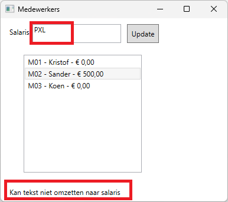

# Oefening 3: Medewerkers

Maak een applicatie voor het beheer van medewerkers.Voor zie een textbox
en een listbox en hou rekening met de volgende schermvoorwaarden:

-   We hebben een window object met een hoogte en breedte van 450
    pixels.

-   Onze buttons en tekstvakken hebben een standaard breedte van 100
    pixels.

-   Een listbox heeft standaard in onze toepassing een breedte van 200px
    en een hoogte van 150px.

-   Bij het opstarten van onze toepassing is onze button *updateButton*
    en ons tekstvak *salaryTextBox* geblokkeerd

We krijgen volgende records van onze personeelsdienst:

-   Medewerkers -\> \"Kristof;Sander;Koen\";

-   MedewerkerNummers -\> \"M01;M02;M03\";

-   Salarissen -\> \"0;0;0\";

Onze toepassing moet werken met arrays omdat we nog gegevens moeten
kunnen beheren.

Volgende arrays moeten gebruikt worden in het programma en moeten de
data krijgen van de records die we van onze personeelsdienst hebben
gekregen:

-   string\[\] employees;

-   string\[\] employeeNumbers;

-   decimal\[\] salaries;

Zoals jullie kunnen zien is de listbox opgevuld, dit moet a.d.h.v. onze
arrays gebeuren, in een functie Output(),.wanneer de toepassing start.
We moeten nu een programma schrijven voor het beheren van de salarissen.

Als we een element uit onze listbox selecteren wordt het juiste salaris
getoond in het tekstvak en worden zowel het tekstvak als de button terug
bewerkbaar

Wanneer er op de "Update" knop geklikt wordt moet de ingegeven waarde
worden geupdate in de listbox. Als we de waarde niet kunnen converteren
naar een nieuw salaris dan tonen we een error boodschap in ons label
errorLabel.

Als we de waarde wel correct kunnen omzetten dan wordt de listbox en
bijhorende array salarissen aangepast.

En wordt ook onze error boodschap aangepast

Na de update wordt ons tekstvak salaryTextBox leeg gemaakt en wordt
samen met de button terug geblokkeerd!
